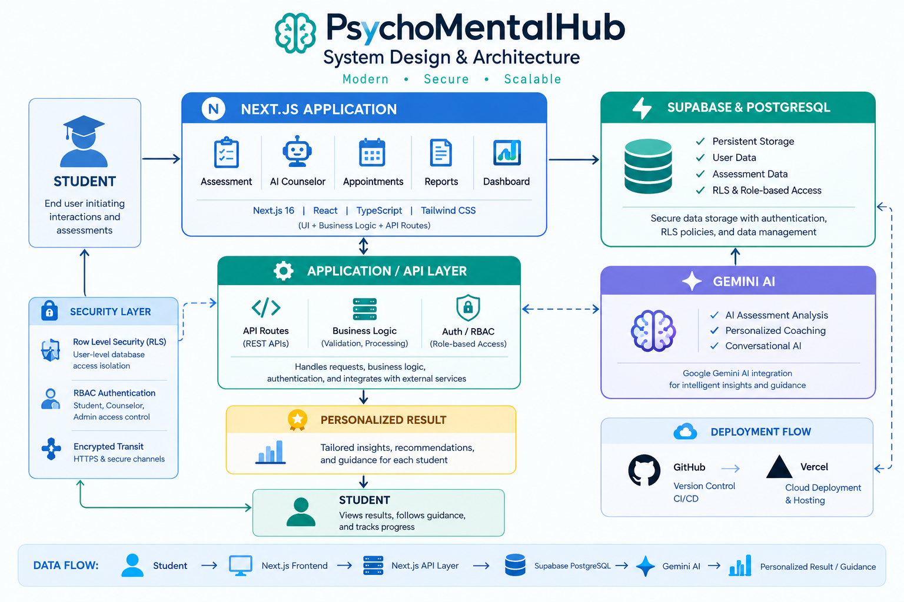

# PsychoMentalHub

PsychoMentalHub is an AI-powered mental wellness platform designed with university students in mind. It combines structured wellness assessments, AI-assisted insights, personalized recommendations, AI Counselor conversations, appointments, and wellness reports in one full-stack application.

> **Note:** PsychoMentalHub is designed for educational and self-awareness purposes. AI-generated results do not represent a medical diagnosis and should not replace professional mental health care.

🔗 **Live Demo:** https://psychomentalhub.vercel.app  
💻 **GitHub:**(https://github.com/akshuvo101/psychomentalhub)

---

## Why PsychoMentalHub?

Mental well-being can easily be overlooked alongside studies, work, responsibilities, and everyday challenges.

PsychoMentalHub was built to make wellness assessment and self-awareness more accessible for university students by combining structured assessments with AI-assisted insights and conversational guidance.

The goal is to provide a simple platform where students can understand their wellness, reflect on their experiences, and take a first step toward support.

---

## Key Features

### Student Portal

- Secure registration and login
- Google authentication
- Student profile management
- Structured mental wellness assessment
- AI-assisted assessment analysis
- Wellness/risk score
- Mental-state classification
- AI confidence score
- Category-based wellness insights
- Personalized recommendations
- WellMind AI Counselor
- Assessment history
- Downloadable PDF reports
- Responsive dashboard
- Light and dark mode

### Counselor Portal

- Counselor dashboard
- Student wellness information
- Assessment review
- Appointment management
- Counseling-related information access

### Admin Portal

- Administrative dashboard
- User management
- Appointment oversight
- Platform administration
- System-level management

---

## AI-Powered Wellness

PsychoMentalHub uses **Google Gemini AI** for assessment analysis and conversational wellness guidance.

The assessment system evaluates wellness-related areas such as:

- Stress
- Anxiety
- Depression
- Burnout
- Sleep
- Focus
- Social well-being
- Mood

AI-assisted results can include:

- Wellness/risk score
- Mental-state classification
- Confidence level
- Category-based insights
- Personalized recommendations
- Natural-language wellness guidance

### WellMind AI

WellMind AI provides conversational wellness guidance around areas such as stress, anxiety, study pressure, sleep, focus, emotional well-being, and healthy habits.

It is designed for general wellness and self-awareness, not professional diagnosis or treatment.

---

## System Architecture



The application uses **Next.js** as the frontend and application/API layer, **Supabase PostgreSQL** for data storage, and **Google Gemini AI** for AI-powered analysis and conversational guidance.

The application layer connects the frontend, authentication, database, and AI services while enforcing application-level authorization and database-level security policies.

### Main Components

- **Next.js** — Frontend, dashboards, assessments, appointments, reports, and AI Counselor
- **Next.js API Layer** — API requests, validation, business logic, authorization, and external service integration
- **Supabase PostgreSQL** — Relational database
- **Supabase Auth** — Authentication and session management
- **Row Level Security (RLS)** — Database-level access control
- **Google Gemini AI** — AI-assisted analysis and conversational guidance
- **Vercel** — Deployment and hosting

### Data Flow

```text
Student
   │
   ▼
Next.js Frontend
   │
   ▼
Next.js Application / API Layer
   │
   ├──────────────► Supabase PostgreSQL
   │
   └──────────────► Google Gemini AI
                         │
                         ▼
                 AI Insights / Guidance
Tech Stack
Frontend
Next.js
React
TypeScript
Tailwind CSS
Backend & Database
Next.js API Routes
Supabase
PostgreSQL
Supabase Authentication
Row Level Security (RLS)
AI
Google Gemini AI
Libraries & Services
Lucide React
Framer Motion
Sonner
jsPDF
jsPDF AutoTable
Resend
Deployment & Version Control
Vercel
Git
GitHub
Authentication & Security

PsychoMentalHub uses Supabase Authentication together with role-based authorization and database-level security.

The platform supports three roles:

Role	Primary Responsibility
Student	Complete assessments, view wellness insights, use AI guidance, and manage personal information
Counselor	Review student wellness information and manage counseling-related activities
Admin	Manage users and oversee platform-level operations

Security mechanisms include:

Supabase Authentication
Role-based authorization
Row Level Security (RLS)
Protected application routes
Server-side API operations
Environment variables for sensitive credentials
HTTPS and secure communication

Sensitive API keys and credentials are stored through environment variables and should never be committed to the repository.

Assessment Workflow
Student
   │
   ▼
Complete Assessment
   │
   ▼
Assessment Saved
   │
   ▼
AI Analysis
   │
   ▼
Wellness Evaluation
   │
   ├── Risk Score
   ├── Mental State
   ├── Confidence
   ├── Category Insights
   └── Recommendations
   │
   ▼
Assessment Result
   │
   ├── View Online
   └── Generate PDF Report

Assessment data is saved before AI analysis is finalized, helping preserve the submitted assessment when the external AI service is temporarily unavailable.

Assessment Reports

PsychoMentalHub generates downloadable PDF assessment reports containing information such as:

Assessment overview
Wellness/risk score
Mental-state classification
AI-generated wellness summary
Category-based insights
Recommended wellness actions
Educational and self-awareness disclaimer
AI Service Reliability

The core assessment data remains available even when the Gemini API reaches a usage limit or becomes temporarily unavailable.

In such cases:

Submitted assessments remain saved
Users receive a clear availability message
Assessments are not treated as lost
AI analysis can be retried when the service becomes available
Getting Started
Prerequisites

Make sure you have:

Node.js
npm
Git
Supabase
Google Gemini AI
Resend
1. Clone the Repository
git clone <repository-url>
cd psychomentalhub
2. Install Dependencies
npm install
3. Configure Environment Variables

Create a .env.local file in the project root:

NEXT_PUBLIC_SUPABASE_URL=your_supabase_url
NEXT_PUBLIC_SUPABASE_ANON_KEY=your_supabase_anon_key

GEMINI_API_KEY=your_gemini_api_key
GEMINI_MODEL=gemini-flash-latest

NEXT_PUBLIC_SITE_URL=http://localhost:3000

RESEND_API_KEY=your_resend_api_key

Never commit .env.local or private API credentials to the repository.

4. Run the Development Server
npm run dev

Open:

http://localhost:3000
Deployment

PsychoMentalHub is deployed using Vercel.

The production deployment uses GitHub for version control and Vercel for cloud hosting.

Before deployment, configure the required environment variables in the Vercel project settings.

User Experience

The platform focuses on a clean, responsive, and accessible experience.

Key design considerations include:

Responsive layouts
Mobile-friendly interfaces
Light and dark themes
Clear information hierarchy
Consistent visual design
Loading and error states
AI service availability handling
Focused wellness-oriented interfaces
Academic Context

PsychoMentalHub was developed as a Computer Science & Engineering academic and portfolio project at:

Bangladesh University of Business & Technology (BUBT)

The project demonstrates practical implementation of:

Full-stack web development
Next.js and React architecture
Authentication and authorization
Relational database design
Row Level Security
AI API integration
API development
PDF generation
Responsive UI/UX
Cloud deployment
Project Status

Active Academic & Portfolio Project

The core platform includes:

Authentication
Role-based access
Student wellness assessment
AI-assisted assessment analysis
AI Counselor
Wellness insights
Personalized recommendations
PDF reporting
Counselor functionality
Administrative functionality
PostgreSQL data management
Future Improvements

Potential future improvements include:

Advanced wellness analytics
Real-time counselor communication
Video consultation
Mobile application
Enhanced progress visualization
Expanded counselor workflows
License

Copyright © 2026 AK Shuvo.

This project is presented for academic and portfolio purposes. The source code and original project materials are not licensed for unrestricted commercial reuse, redistribution, modification, or resale without permission.

See the LICENSE file for the complete license terms.

Developer

AK Shuvo

Computer Science & Engineering
Bangladesh University of Business & Technology (BUBT)

Built With

Next.js • React • TypeScript • Tailwind CSS • Supabase • PostgreSQL • Google Gemini AI
